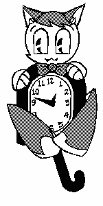

<p align="center">
  
</p>

jenclock
========

Catclock but instead of a kit cat clock its Jenny. Art is by me, 99% of the code
is from upstream. Had to make a few modifications so the tail wouldn't draw over
her feet and stuff like that.

## Tempo Tracking

This version is able to track the music tempo and move cat eyes and tail in sync with music.
To build it with tempo tracking enabled you will need an additional library which powers the tempo tracking:

```bash
sudo apt install libaubio5 libaubio-dev
```

Use the `WITH_TEMPO_TRACKER=1` option to compile with tempo tracker enabled:

```bash
make WITH_TEMPO_TRACKER=1
```

After running clock in "cat" mode run some PulseAudio mixer (for example - `pavucontrol`) and select desired audio source for analysis on the "Recording" tab.

## Usage

```
xclock [toolkitoptions]
       [-mode <analog, digital, cat>]
       [-alarm]  [-bell]  [-chime]
       [-file <alarm file>]  [-period <seconds>]
       [-hl <color>]  [-hd <color>]
       [-catcolor <color>]
       [-detailcolor <color>]
       [-tiecolor <color>]
       [-padding <pixels>]
       [-update <seconds>]
       [-ntails <number>]
       [-help]
```

Enjoy!
